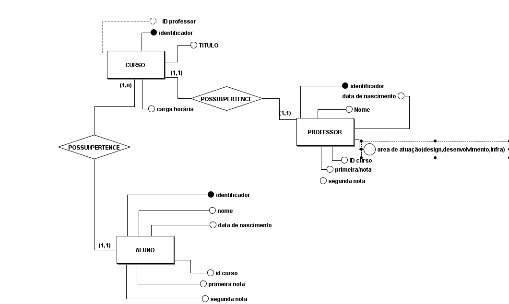
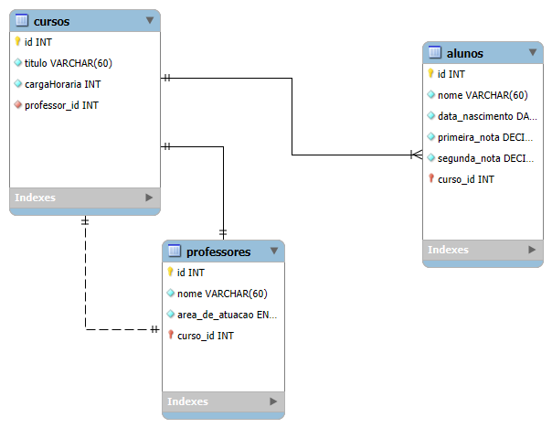

# maycon_atividade-banco-de-dados
 atividade de modelo conceitual de banco de dados
 
## Modelo conceitual 
 

## Modelo logico 

 

## Modelagem fisica  
```sql 
CREATE DATABASE  tecinternet_escola_maycon CHARACTER SET utf8mb4; 


CREATE TABLE cursos( 
    id INT NOT NULL PRIMARY KEY AUTO_INCREMENT, 
    titulo VARCHAR(60) NOT NULL,  
    carga_horaria INT NOT NULL, 
    professor_id INT  NULL, -- será chave estrangeira opcional 
    
);  

CREATE TABLE professores( 
    id INT NOT NULL PRIMARY KEY AUTO_INCREMENT, 
    nome VARCHAR(60) NOT NULL,  
    area_de_atuacao ENUM('design', 'desenvolvimento', 'infra') NOT NULL, 
    curso_id INT NOT NULL, 
   
);  

CREATE TABLE alunos( 
    id INT NOT NULL PRIMARY KEY AUTO_INCREMENT, 
    nome VARCHAR(60) NOT NULL,  
    data_nascimento DATE NOT NULL,  
    primeira_nota DECIMAL NOT NULL, 
    segunda_nota DECIMAL NOT NULL,
    curso_id INT NOT NULL --  será chave estrangeira 
);  


-- chaves estrangeiras  
ALTER TABLE cursos 
 ADD CONSTRAINT fk_cursos_professores FOREIGN KEY (professor_id) REFERENCES professores(id);  

 ALTER TABLE alunos
    ADD CONSTRAINT  fk_alunos_cursos_ 
    FOREIGN KEY(curso_id)  REFERENCES cursos(id);
--chaves estrangeiras        

``` 

## Comandos CRUD  
```sql   
 
-- cadastrando cursos 

INSERT INTO cursos(titulo, carga_horaria) 
VALUES( 
    'Front-End' 
    40, 
    -- deixando nulo o professor_id
);   

INSERT INTO cursos(titulo, carga_horaria) 
VALUES(  
    'Back-End', 
    80

), 
( 
    'UX/UI Design', 
    30
), 
( 
    'Figma', 
    10
), 
( 
    'Redes de Computadores', 
    100
);
 

-- cadastrando profesores 
INSERT INTO professores(nome, area_de_atuacao, curso_id) 
VALUES( 
    'Jon Olivia',  
     'infra', 
    5
);
 
INSERT INTO professores(nome, area_de_atuacao, curso_id) 
VALUES( 
    ' Lemmy Kilmister',  
     'design', 
    4
), 
( 
    'Neil Peart',
    'design', 
    3
), 
( 
    'Ozzy Osbourne',
    'desenvolvimento', 
    2 
), 
(  
    'David Gilmour', 
    'desenvolvimento',
    1 
);

``` 

### Atualizando os Dados 
```sql 
 UPDATE cursos SET professor_id =  

```
